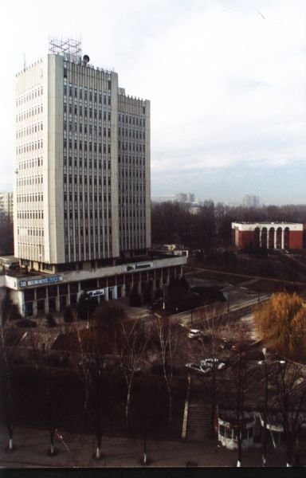

3 января 1963 года, на базе лаборатории по разработке вычислительной техники Научно-исследовательского института электротехнической промышленности был создан завод "ЛУЧ" по производству аналого-вычислительных машин.
 В период своего существования предприятие неоднократно меняло своё название:
1972 год - Завод счетных машин имени “50-летию СССР”;
1984 год - Производственное объединение "СЧЕТМАШ";
1992 год - Производственное объединение "СИГМА";
1995 год - Акционерное общество "СИГМА".
 В процессе деятельности, предприятие специализировались на производстве цифровых и аналого-вычислительных машин специального назначения, применяемые для расчетов в научно-исследовательских институтах, космических центрах и в производстве военной технике.
 В настоящее время предприятие сохранила профиль производства и является одним из основных предприятий Республики Молдова производителей радиоэлектронной аппаратуры и электротехнических изделий.
Предприятие располагает производственными площадями, специальным оборудованием, квалифицированными кадрами для осуществления радиоэлектронного производства с замкнутым циклом.
Основной продукцией общества является производство радиоэлектронной аппаратуры, электротехнических изделий и товаров народного потреблений. Предприятие имеет базы отдыха на берегу Черного Моря и в горах Карпаты.
