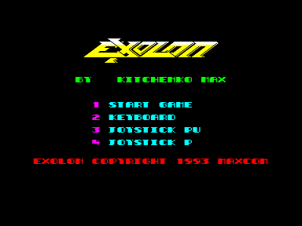
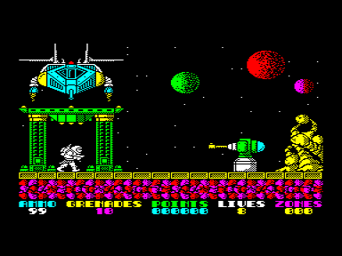

Адаптация культовой игры с ZX Spectrum.
В архиве также [дисковая версия](exolond.com), с бессмертием, [версия от ASOFT](exolon_asoft.rom) с возможностью вкл/выкл бесконечной жизни
и версия с таймерной музыкой от [Ивана Городецкого](../../authors/gorodetskyi).

См. также [Ужас 3](../uzhas3), [Unknown](../unknown)

[ExolonM2](exolon_m2.rom) - версия с автоподстройкой, выбираемыми читами (бесконечные жизни и отключение мин),
музыкой через ВИ53 и корректной инициализацией ВВ55.
Оригинальный вариант игры будет работать без неприемлемых визуальных артефактов только на векторе с КР580ВМ80 (или 580ВМ1) при тактовой частоте 3 МГц.
Предлагаемый вариант с автофиксом будет работать и c другими процессорами (1821ВМ85, z80).
При частотах процессора, отличающихся от 3 МГц (особенно при некратных трем мегагерцам), могут наблюдаться полоски на бордюре.
Главное условие работоспособности фикса - частота таймера ВИ53 должна быть 1,5 МГц.
Скорость игры не фиксируется и будет изменяться в соответствии с тактовой частотой процессора.

В данном варианте биперный проигрыватель музыки заменен на таймерный.

Добавлена инициализация ВВ55 перед опросом РУС/ЛАТ и программированием палитры, отсутствовавшая в оригинальной игре.
Спасибо Вячеславу Славинскому за сообщение об этой недоработке.

Автор модификаций: [Иван Городецкий](../../authors/gorodetskyi). 2011-2019

